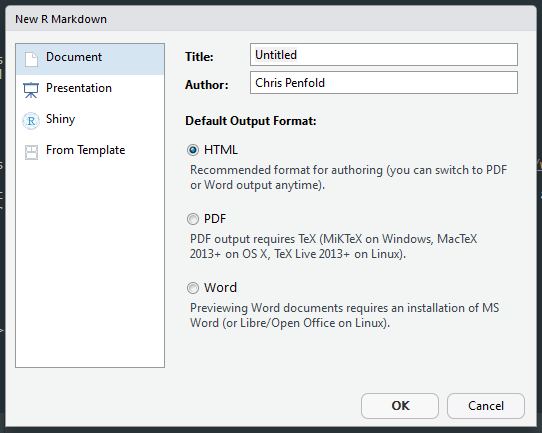

```{r setup, include=FALSE}
knitr::opts_chunk$set(echo = FALSE)
```

<!--Footnotes code from https://stackoverflow.com/a/45569765--> 
<style>
div.footnotes {
  position: absolute;
  bottom: 0;
  margin-bottom: 10px;
  width: 80%;
  font-size: 0.6em;
}
</style>

<script src="https://ajax.googleapis.com/ajax/libs/jquery/3.1.1/jquery.min.js"></script>
<script>
$(document).ready(function() {
  $('slide:not(.backdrop):not(.title-slide)').append('<div class=\"footnotes\">');

  $('footnote').each(function(index) {
    var text  = $(this).html();
    var fnNum = (index+1).toString();
    $(this).html(fnNum.sup());

    var footnote   = fnNum + '. ' + text + '<br/>';
    var oldContent = $(this).parents('slide').children('div.footnotes').html();
    var newContent = oldContent + footnote;
    $(this).parents('slide').children('div.footnotes').html(newContent);
  });
});
</script>


# Overview


## Goals

1. To understand what <span style="color:red">R Markdown</span> is (and isn't)
2. To be able to make your own output from <span style="color:red">R Markdown</span>
3. To be able to apply <span style="color:red">R Markdown</span> to your own work
    + Or know that it's not for you!

## Outline

### **Lecture** + Tutorial

1. What is <span style="color:red">R Markdown</span>?
2. What can you use <span style="color:red">R Markdown</span> for?
3. How does it work?

## Outline

### Lecture + **Tutorial**

Make your own <span style="color:red">R Markdown</span> document

## What is <span style="color:red">R Markdown</span>?

  

More specifically:

> Text + R output + graphics (+ R code) into a single document

## Possible uses {.build}

1. Quick report
    + R Notebooks
2. Full research paper
3. Presentation
4. PhD thesis...
5. Web page
6. eBook
7. Blog etc...

<center><font size="10">**Reproducible research**</font></center>

## Markdown


<center>"Markdown is a lightweight markup language with plain text formatting syntax." <footnote>Source: Wikipedia</footnote></center>

## Markdown - input {.build}

```{r, fig.align='center', out.width="75%"}

```

## Markdown - output

```{r, fig.align='center', out.width="75%"}

```

## Rmd to output

```{r, fig.align='center', out.width="100%"}
knitr::include_graphics('images/rmd to output.png')
```

---

```{r, fig.align='center', out.width="75%"}
knitr::include_graphics("images/rmd_output.png")
```

## Making a <span style="color:red">R Markdown</span> file

```{r, fig.align='center', out.width="75%"}

```

---

```{r, fig.align='center', out.width="75%"}

```

---

```{r, fig.align='center', out.width="100%"}

```

## <span style="color:red">R Markdown</span> anatomy | YAML (aka _header_)

```{r, fig.align='center', out.width="100%"}

```

## <span style="color:red">R Markdown</span> anatomy | Markdown text

```{r, fig.align='center', out.width="100%"}
knitr::include_graphics("images/text_markdown.png")
```

## <span style="color:red">R Markdown</span> anatomy | Code 'chunks'

```{r, fig.align='center', out.width="100%"}

```
<code>
    \`\`\`{r cars}  
    summary(cars)  
    \`\`\`  
    </code>


```{r, fig.align='center', out.width="100%"}

```
<code>
    \`\`\`{r pressure, echo=FALSE}  
    plot(pressure)  
    \`\`\`  
    </code>

## <span style="color:red">R Markdown</span> anatomy | Setup code 'chunk'

```{r, fig.align='center', out.width="100%"}

```

+ Useful for setting up advanced options
+ Also used for code not related to outputs, e.g.
  + data cleaning
  + deriving variables to be used later
+ With `include=FALSE`, the code chunk will be evaluated (unless `eval=FALSE`), but the output will be completely suppressed.
 
## <span style="color:red">R Markdown</span> anatomy | Rendering the document

Then we 'knit' (render) the document

* Either by pressing the 'Knit' button in RStudio:
```{r, fig.align='center', out.width="33%"}

```

OR

* Press 'ctrl' + 'shift' + 'k'


## <span style="color:red">R Markdown</span> anatomy | _et voila:_ [rendered output](./example/example_html.html)

```{r, fig.align='center', out.width="75%"}

``` 

## Slide with Bullets {.build}

If I type:

`- Bullet 1`  
`- Bullet 2`  
`- Bullet 3`  

I get:

- Bullet 1
- Bullet 2
- Bullet 3


## Slide with R Output {.build}

```{r cars, echo = TRUE}
summary(iris)
```

## Slide with Plot {.build}

```{r , echo = TRUE}
plot(iris$Petal.Length, iris$Petal.Width)
```

## Slide with ggplot2 {.build}

```{r , echo = TRUE, eval = FALSE}
library(ggplot2)
ggplot(data = iris) + 
  geom_point(aes(x = Petal.Length, 
                 y = Petal.Width, 
                 colour = Species)) + 
  labs(title = 
         "Relationship between petal length and width, by species", 
       x = "Petal length", 
       y = "Petal width")
```

## Slide with ggplot2

```{r , echo = FALSE}
library(ggplot2)
ggplot(data = iris) + 
  geom_point(aes(x = Petal.Length, 
                 y = Petal.Width, 
                 colour = Species)) + 
  labs(title = 
         "Relationship between petal length and width, by species", 
       x = "Petal length", 
       y = "Petal width")
```

## Slide with table {.build}

```{r, echo = TRUE, eval = TRUE} 

summary(iris)

```

## Formatted table {.build}

```{r , echo = TRUE, eval = FALSE}
library(arsenal)
table_one <- tableby(Species ~ ., 
                     data = iris, 
                     test=FALSE, 
                     total=FALSE)
summary(table_one)
```

## Formatted table

```{r , echo = TRUE, eval = FALSE}
print(
  
|  | setosa (N=50) | versicolor (N=50) | virginica (N=50) |
|:-----------------|:-------:|:-------:|:-------:|
|**Sepal.Length**            |      |       |       |
|Mean (SD) | 5.006 (0.352) |   5.936 (0.516)   |  6.588 (0.636)   |
|Range     | 4.300 - 5.800 |   4.900 - 7.000   |  4.900 - 7.900   |
|**Sepal.Width**             |        |         |    |
|Mean (SD) | 3.428 (0.379) |   2.770 (0.314)   |  2.974 (0.322)   |
|Range     | 2.300 - 4.400 |   2.000 - 3.400   |  2.200 - 3.800   |
|**Petal.Length**            |       |         |    |
|Mean (SD) | 1.462 (0.174) |   4.260 (0.470)   |  5.552 (0.552)   |
|Range     | 1.000 - 1.900 |   3.000 - 5.100   |  4.500 - 6.900   |
|**Petal.Width**             |       |        |    |
|Mean (SD) | 0.246 (0.105) |   1.326 (0.198)   |  2.026 (0.275)   |
|Range     | 0.100 - 0.600 |   1.000 - 1.800   |  1.400 - 2.500   |
  
)
```

## Formatted table {.table-condensed}

```{r , echo = FALSE, eval = TRUE, results="asis"}
library(arsenal)
table_one <- tableby(Species ~ ., 
                     data = iris, 
                     test=FALSE, 
                     total=FALSE)
summary(table_one)
```


## Inline maths {.build}

- You can insert results of R code using 3 backticks \`\`\`

    <code>
    \`\`\`{r}  
    code here  
    \`\`\`  
    </code>

- Simple maths example

```{r, echo=TRUE}
2 + 3
```

- To do this I typed

\`\`\`{r}  
2 + 3  
\`\`\`

## Inline maths {.build}

+ You can also do this 'inline' like this 

    <code> \` r 2 + 3 \` </code> 

But only the results are shown:

+ `r 2 + 3`
    
## Equations

You can get nicely formatted equations using MathJax:

E.g. population regression line

$$E(y) = \alpha + \beta{x}$$

$$var(y) = \sigma^2$$


These can also be inline: $\hat{y} = a + bx$

## Example 

*"Could you just re-run this with..."*

## R Notebook - standalone <span style="color:red">R Markdown</span> documents

+ R Notebooks are a specific use of <span style="color:red">R Markdown</span>
+ Code and output are combined in a single document
+ R Notebooks can not execute code outside the Notebook (e.g. messy data processing etc.)
+ Particularly suited to quick reports where having embedded code is not a problem
+ Restricted to **html** output
+ Good for archiving analyses and sharing results with collaborators

## R Notebook 

An R Notebook is a special execution mode of R Markdown with two characteristics that make it very useful for communicating results<footnote>from <https://www.r-bloggers.com/communicating-results-with-r-markdown/></footnote>:

+ Rendering a preview of an R Notebook does not execute R code, making it computationally convenient to create reports during or after interactive analyses.
+ R Notebooks have an embedded copy of the source code, making it convenient for others to examine your work.

## R Notebook - example

## Times to use <span style="color:red">R Markdown</span>

|PROBLEM |	COMMON TOOL |	BETTER TOOL|
|--------|--------------|-------------|
|Share reports and presentations	| Microsoft Office |	<span style="color:red">R Markdown</span>|
|Summarize and share your interactive analyses	| R Scripts	| R Notebooks|


## R Markdown - hype check... {.build}

```{r, fig.align='center', out.width="75%"}
knitr::include_graphics('images/gartner hype.jpg')
```

## R Markdown - Key limitations {.build}

+ Tables  
    + New packages improve this all the time
    + e.g. `arsenal` (+ `broom`)
+ How does this fit into a typical paper writing workflow?

---

```{r, echo=FALSE, fig.align='center'}
library(png)
library(grid)
library(gridExtra)
img1 <-  rasterGrob(as.raster(readPNG("images/rmarkdown_logo.png")), interpolate = FALSE)
img2 <-  rasterGrob(as.raster(readPNG("images/oneway.png")), interpolate = FALSE)
img3 <-  rasterGrob(as.raster(readPNG("images/Microsoft-Word-2013-icon.png")), interpolate = FALSE)
grid.arrange(img1, img2, img3, ncol = 3)
```

 
## Any questions???

* Slides are available at:
    + Slides available at GitHub:
    + [https://github.com/Chris-M-P/Rmarkdown](https://github.com/Chris-M-P/Rmarkdown)

### Useful links
* RStudio R Markdown resources - <https://rmarkdown.rstudio.com/>
* *R Markdown: The Definitive Guide* - [link](https://bookdown.org/yihui/rmarkdown/)
* R Markdown cheatsheet - available from RStudio:
    + *Help > Cheatsheets > R Markdown Cheat Sheet*
* Stackoverflow `Rmarkdown` tag - <https://stackoverflow.com/questions/tagged/r-markdown>
    
    